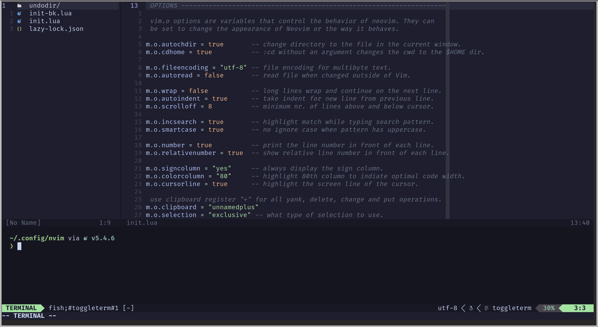

# MinimaNvim

This repo contains my neovim config as a single `init.lua` file.



Features :

- file explorer with [oil](https://github.com/stevearc/oil.nvim) ~ open/edit files and folders.
- fuzzy finder with [telescope](https://github.com/nvim-telescope/telescope.nvim) ~ search for text, files, diagnostics and a lot more.
- terminal support with [toggleterm](https://github.com/akinsho/toggleterm.nvim) ~ open terminal within neovim.
- session manager with [auto-session](https://github.com/rmagatti/auto-session) ~ blink back to what you were working on.
- statusline with [lualine](https://github.com/nvim-lualine/lualine.nvim) ~ to display relevant info.
- syntax highlighting with [tree-sitter](https://github.com/tree-sitter/tree-sitter) ~ installed automatically for opened file.
- git support with [vim-fugitive](https://github.com/tpope/vim-fugitive) and [gitsigns](https://github.com/lewis6991/gitsigns.nvim) ~ run git commands from within neovim, and display git signs.
- colorscheme with [catppuccin](https://github.com/catppuccin/catppuccin) ~ to make it beautiful.
- [mason](https://github.com/williamboman/mason.nvim) ~ install any lsp, formatter, linter or dap. ( how to setup )
- lsp with [nvim-lspconfig](https://github.com/neovim/nvim-lspconfig) and [null-ls](https://github.com/jose-elias-alvarez/null-ls.nvim)
- auto-completion with [nvim-cmp](https://github.com/hrsh7th/nvim-cmp) and [luasnip](https://github.com/L3MON4D3/LuaSnip)

Along with sane defaults and keymappings.

## What is it ?

- MinimaNvim is a single file neovim config written in lua aiming to provide a (highly opiniated) base config.
- The configuration is well-commented to provide a clear and concise overview of the different blocks of code. This makes it easy to understand what each block does, so users can easily play with the configuration and evolve it as they like.

What is neovim ? Any why bother configurig it ?

It is an editor just like notepad or gedit. What's special about neovim is that it is a modal text editor that is designed to be fast and efficient. You can extend its functionality using plugins, and hence it makes up for a great programming editor since you can add functionalities that you want, and ultimately create your [PDE](https://www.youtube.com/watch?v=QMVIJhC9Veg) ( personalized development environment ).

## How to use it ?

- Install neovim.
- Backup current nvim and shared folder.
  ```bash
  mv ~/.config/nvim ~/.config/nvim.bak
  mv ~/.local/share/nvim ~/.local/share/nvim.bak
  ```
- Clone this repo
  ```bash
  git clone --depth 1 https://github.com/commitsovercoffee/minima-nvim ~/.config/nvim
  ```
- Open neovim. ( it may show black screen for a second or two )
- All packages will be automatically installed.

## Mason package not working ?

After installing packages using ":mason" you will need to add that package in the config.

- To setup lsp follow [these](https://github.com/commitsovercoffee/minima-nvim/blob/main/init.lua#L234) steps.
- To setup linter, formatter etc follow [these](https://github.com/commitsovercoffee/minima-nvim/blob/main/init.lua#L286) steps.

## Status

This project is my daily driver. I contribute to this project if and when I come across something useful or to add bugfixes.
